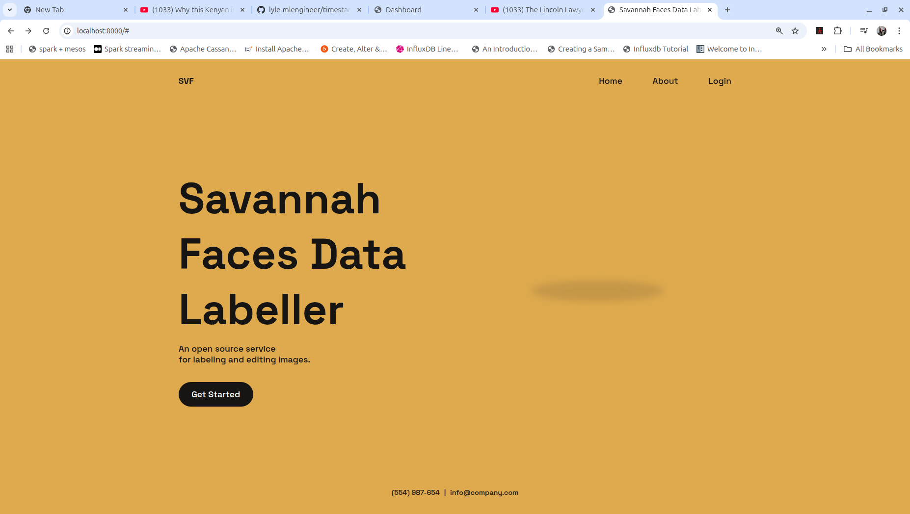

# Immage-Annotator
## Overview
A web application for collecting, editing and labelling images for machine learning.



The application supports:
1. Uploading images from the local file system
2. Downloading images from remote urls
3. Editing images
4. Labelling images (detailed descriptions)

The application was built to enable easy and quick creation of datasets used in training image based models, including:
- Text to image
- Image to text
- Image to image

The application supports the use of pretrained models to fasten the data labelling process. Other services supported include search and upload to Huggingface.

## Getting started
To use this application, you will need a YouTube API key, a computer with python installed.

1. Clone the GitHub repo
```sh
  git clone https://github.com/lyle-mlengineer/image-annotator.git
```
2. Navigate to the project directory:
```sh
cd image-annotator
```
3. Create the environment variables. Add them to the ```.env``` file.
4. Start the application:
```
uvicorn app.main:app
```
5. Navigate to ``http://localhost:8000`` to access the application.

From there you can upload images, search through the gallery, label and edit the images, visit the dashboard etc

## Usage
A sample application that uses this web api to collect and label data used to train a diffusion model is found at [Savanna Faces Github Repo](https://github.com/lyle-mlengineer/savannafaces)